# Análisis del Shared Kernel — TaskX Monorepo

> **Arquitecto:** Claude Code (claude-sonnet-4-6)
> **Fecha:** 2026-03-24
> **Alcance:** `/packages/*` — 18 paquetes, 526 archivos TypeScript fuente
> **Patrón Central:** Shared Kernel (Domain-Driven Design)

---

## 1. ¿Qué es el Shared Kernel?

En Domain-Driven Design, el **Shared Kernel** es el conjunto de código que múltiples contextos delimitados (Bounded Contexts) comparten deliberadamente. Es la "biblioteca central" del monorepo — el código que, si cambia, puede impactar a múltiples equipos.

En TaskX, este kernel vive en `/packages/` y se divide en cuatro capas:

```
/packages/
├── Domain        → Modelos de negocio compartidos
├── Infrastructure → Wrappers de AWS y bases de datos
├── UI            → Componentes visuales y temas
└── Tooling       → Configuración de build y utilidades
```

---

## 2. Clasificación de Paquetes

### 2.1 Domain Packages — La "Verdad" del Negocio

Son los paquetes que definen **qué es** el sistema, no cómo funciona técnicamente.

| Paquete | Ruta Absoluta | Responsabilidad | Archivos TS |
|---------|--------------|-----------------|-------------|
| `@findex/taskx-sdk` | `/packages/taskx-sdk/` | **Core del dominio.** Modelos de instancias, tareas, billing, capacity, integraciones (IManage, LedgerLink, JST). Fuente única de verdad de tipos de negocio. | 280 |
| `@findex/fdx.dna.entities` | `/packages/fdx.dna.entities/` | Entidades de acceso a datos: `ClientList`, `User`, `Pagination`, `AuthorizationUserGroup`. Depende de `fdx.dna.patterns`. | 33 |
| `@findex/fdx.dna.data-change-log` | `/packages/fdx.dna.data-change-log/` | Interfaces de historial de cambios: `IRepositoryHistoryProvider`, `IChangeHistoryRecorder`. | 10 |
| `@findex/fdx.dna.expressions` | `/packages/fdx.dna.expressions/` | Motor de evaluación de expresiones dinámicas/fórmulas (JSONata). | 23 |

**¿Cómo centralizan la "verdad" del negocio?**

El `@findex/taskx-sdk` es el ejemplo más claro. Frontend Angular y backend Lambda comparten los mismos tipos TypeScript. Si el backend define `TaskInstance`, el frontend lo consume directamente del mismo paquete. **No hay contratos OpenAPI ni JSON Schema intermedios** — el SDK compilado es la fuente de verdad. Un cambio de tipo en el SDK genera error de compilación en todos los consumidores simultáneamente.

---

### 2.2 Infrastructure Packages — Wrappers de AWS y BD

Estos paquetes implementan el **Adapter Pattern**: envuelven SDKs externos y exponen interfaces propias. Ninguna app del monorepo importa directamente `@aws-sdk`.

| Paquete | Ruta Absoluta | Tecnología Envuelta | Archivos TS |
|---------|--------------|---------------------|-------------|
| `@findex/fdx.dna.patterns` | `/packages/fdx.dna.patterns/` | — (patrones base: Result, Logger, Signal) | 43 |
| `@findex/fdx.dna.backend.core` | `/packages/fdx.dna.backend.core/` | Lambda/Express, JWT (JWKS-RSA), API Keys | 30 |
| `@findex/fdx.dna.events` | `/packages/fdx.dna.events/` | AWS SNS/SQS SDK | 13 |
| `@findex/fdx.dna.persistence.s3` | `/packages/fdx.dna.persistence.s3/` | AWS S3 SDK + auditoría | 9 |
| `@findex/fdx.dna.persistence.open-search` | `/packages/fdx.dna.persistence.open-search/` | OpenSearch SDK | 7 |
| `@findex/fdx.dna.persistence.tmpfs` | `/packages/fdx.dna.persistence.tmpfs/` | Sistema de archivos en memoria | 6 |

---

### 2.3 UI Packages — Componentes y Temas Compartidos

| Paquete | Ruta Absoluta | Responsabilidad | Archivos TS |
|---------|--------------|-----------------|-------------|
| `@findex/fdx.dna.common-components` | `/packages/fdx.dna.common-components/` | 40+ componentes React/MUI: Accordion, Alert, Avatar, Badge, Button, Grid-Layout, Modals | 17 |
| `@findex/fdx.dna.styles` | `/packages/fdx.dna.styles/` | Tema MUI, variables de color, tipografía. Fuente única de identidad visual. | 18 |
| `@findex/fdx.dna.forms-react` | `/packages/fdx.dna.forms-react/` | Formularios data-driven (Data Driven Forms + MUI) | 17 |
| `@findex/fdx.dna.csa-generator` | `/packages/fdx.dna.csa-generator/` | Generador de CSA (Client Service Agreement) | 9 |
| `@findex/fdx.dna.frontend-state-management` | `/packages/fdx.dna.frontend-state-management/` | Redux hooks y thunks compartidos entre MFEs | 8 |

---

### 2.4 Tooling Packages — Configuración Compartida

| Paquete | Responsabilidad |
|---------|-----------------|
| `tsconfig` | Configuraciones base TypeScript reusables (`tsconfig.base.json`) |
| `eslint-config-custom` | Reglas ESLint compartidas + lint-staged |
| `@findex/fdx.dna.utils` | Utilidades sin dependencias de runtime (`emailUtils`) |

---

## 3. Patrones de Diseño en los Paquetes

### 3.1 Adapter Pattern — Paquetes de Persistencia

Los tres paquetes de persistencia + el paquete de eventos implementan el patrón **Adapter** clásico:

```
Tecnología externa        →     Adapter (paquete)          →    Interfaz propia
─────────────────────────────────────────────────────────────────────────────────
AWS S3 SDK (@aws-sdk/s3)  →  fdx.dna.persistence.s3       →  S3Service, S3DataService
OpenSearch SDK            →  fdx.dna.persistence.open-search → OpenSearchService
AWS SNS/SQS               →  fdx.dna.events                →  IEventService
Sistema de archivos       →  fdx.dna.persistence.tmpfs     →  FileSystemStorage
```

**Beneficio central:** Ninguna app del monorepo importa directamente `@aws-sdk`. Si AWS cambia su SDK (v2 → v3 ya ocurrió), solo se modifica el paquete Adapter. Las 13 apps que lo consumen no se enteran.

**Bonus — Fake/Test Double:**
`fdx.dna.persistence.tmpfs` implementa la **misma interfaz** que `fdx.dna.persistence.s3` pero en memoria. Las Lambdas pueden ser testeadas sin una cuenta AWS real:

```typescript
// En tests: inyecta tmpfs en lugar de s3
const storage = new FileSystemStorage(); // misma interfaz que S3Service
```

**Bonus — Decorator Pattern:**
`fdx.dna.persistence.s3` compone `fdx.dna.data-change-log` para agregar auditoría automática a cada operación S3. Cada escritura genera un registro de historial sin que la app sepa que ocurre.

---

### 3.2 Result Monad — Manejo de Errores Tipado

`@findex/fdx.dna.patterns` expone el tipo `Result<T, E>` (también conocido como **Either monad**). Es el patrón de manejo de errores más importante del monorepo — usado por 11 consumidores.

**El problema que resuelve:**

```typescript
// ❌ Sin Result — los errores son invisibles en la firma de la función
async function getClient(id: string): Promise<Client> {
  // Puede lanzar excepción. El llamador no sabe qué esperar.
}

// ✅ Con Result — los errores son ciudadanos de primera clase
async function getClient(id: string): Promise<Result<Client, NotFoundError | NetworkError>> {
  // El llamador DEBE manejar ambos casos. El compilador lo fuerza.
}
```

**Uso típico:**
```typescript
const result = await getClient(id);

if (result.isErr()) {
  // TypeScript sabe que es NotFoundError | NetworkError
  logger.error(result.error.message);
  return;
}

// TypeScript sabe que es Client — sin casteos
console.log(result.value.name);
```

**Por qué es enterprise-grade:** Elimina los `try/catch` anidados y hace los errores posibles explícitos en las firmas de función. Un nuevo developer puede leer la firma y saber exactamente qué puede salir mal sin leer la implementación.

---

## 4. Análisis de Consumo — cómo los MFEs importan los paquetes

### El mecanismo: `workspace:*`

```yaml
# pnpm-workspace.yaml del proyecto raíz
packages:
  - 'apps/*'
  - 'packages/*'
  - 'frontend/'
  - 'backend/'
```

```json
// apps/fdx.dna.client-listing.mfe/package.json
{
  "dependencies": {
    "@findex/fdx.dna.common-components": "workspace:*",
    "@findex/fdx.dna.styles": "workspace:*",
    "@findex/taskx-sdk": "workspace:*"
  }
}
```

`workspace:*` le dice a pnpm: *"usa siempre la versión local del monorepo, no busques en npm registry"*. pnpm crea un symlink directo:

```
apps/fdx.dna.client-listing.mfe/node_modules/@findex/fdx.dna.common-components
  → ../../packages/fdx.dna.common-components
```

Cualquier cambio en `fdx.dna.common-components` es visible en el MFE **inmediatamente**, sin publish.

### Anomalía detectada: `workspace:^`

En 2 casos se encontró `workspace:^` en lugar de `workspace:*`:
- `awaiting-client.api` → `fdx.dna.persistence.tmpfs`
- `client-listing.mfe` → `fdx.dna.forms-react`

`workspace:^` introduce resolución semántica diferida — puede no usar la versión local si las versiones no son compatibles. Debe normalizarse a `workspace:*`.

---

## 5. God Package Assessment: `@findex/taskx-sdk`

| Métrica | Valor | Señal |
|---------|-------|-------|
| Archivos TypeScript | **280** (53% del total de paquetes) | 🔴 |
| Exports públicos | **189+** | 🔴 |
| Consumidores directos | **10** (todos los proyectos) | 🔴 |
| Versión | **24.1.0** (breaking changes frecuentes) | 🔴 |
| Dominios mezclados | **30+** subdirectorios | 🔴 |

**Veredicto: God Package.** Viola el principio de Single Responsibility a nivel de paquete y el principio de Bounded Contexts de DDD. Billing, capacity, IManage integration, y document management no deberían vivir en el mismo paquete.

**Refactoring recomendado:**
```
@findex/taskx-sdk (actual)
    ↓ descomponer en:
@findex/taskx-sdk-core          → tipos base, utils
@findex/taskx-sdk-workflow      → instance, step, transition, milestone
@findex/taskx-sdk-scoping       → scoping, pricing, billing, payment-schedule
@findex/taskx-sdk-integrations  → IManage, LedgerLink, JST, Jira
@findex/taskx-sdk-capacity      → capacityManagement, teams
```

---

## 6. Grafo de Dependencias (Bottom-Up)

```mermaid
graph BT
    %% ── Tooling (base) ──────────────────────────────────────────
    tsconfig["tsconfig\n(TS Config)"]
    eslint["eslint-config-custom\n(ESLint)"]

    %% ── Layer 0: Fundaciones ────────────────────────────────────
    SDK["@findex/taskx-sdk\n⚠️ GOD PACKAGE\n280 archivos / 189+ exports"]
    PATTERNS["@findex/fdx.dna.patterns\nResult Monad, Logger, Signal"]
    UTILS["@findex/fdx.dna.utils\n(Email utils)"]

    %% ── Layer 1: Domain ─────────────────────────────────────────
    ENTITIES["@findex/fdx.dna.entities\nClient, User, Pagination"]
    CHANGELOG["@findex/fdx.dna.data-change-log\nChange History Interfaces"]
    EXPRESSIONS["@findex/fdx.dna.expressions\nJSONata Engine"]

    %% ── Layer 2: Infrastructure ─────────────────────────────────
    BACKEND_CORE["@findex/fdx.dna.backend.core\nAuth JWT, Lambda Adapter"]
    EVENTS["@findex/fdx.dna.events\nAdapter: AWS SNS/SQS"]
    S3["@findex/fdx.dna.persistence.s3\nAdapter: AWS S3 + Audit"]
    OPENSEARCH["@findex/fdx.dna.persistence.open-search\nAdapter: OpenSearch"]
    TMPFS["@findex/fdx.dna.persistence.tmpfs\nFake/Test Double de S3"]

    %% ── Layer 3: UI ─────────────────────────────────────────────
    STYLES["@findex/fdx.dna.styles\nMUI Theme + Design Tokens"]
    COMPONENTS["@findex/fdx.dna.common-components\n40+ UI Components React/MUI"]
    FORMS["@findex/fdx.dna.forms-react\nData-Driven Forms"]
    CSA["@findex/fdx.dna.csa-generator\nCSA Generator"]
    STATE["@findex/fdx.dna.frontend-state-management\nRedux Hooks + Thunks"]

    %% ── Applications ────────────────────────────────────────────
    FRONTEND["/frontend\nAngular Shell"]
    BACKEND["/backend\nMain Lambda Handlers"]
    MFEs["apps/*.mfe\n(7 MFEs React)"]
    APIs["apps/*.api\n(7 Lambda APIs)"]

    %% ── Dependencias entre paquetes ─────────────────────────────
    ENTITIES --> PATTERNS
    CHANGELOG --> SDK
    S3 --> CHANGELOG
    BACKEND_CORE --> PATTERNS
    EVENTS --> SDK
    OPENSEARCH --> PATTERNS
    OPENSEARCH --> ENTITIES
    TMPFS --> PATTERNS
    TMPFS --> ENTITIES
    STATE --> SDK
    STATE --> PATTERNS
    CSA --> FORMS

    %% ── Apps → Packages ─────────────────────────────────────────
    FRONTEND --> SDK
    BACKEND --> SDK
    BACKEND --> CHANGELOG
    BACKEND --> EVENTS

    APIs --> BACKEND_CORE
    APIs --> PATTERNS
    APIs --> S3
    APIs --> SDK

    MFEs --> COMPONENTS
    MFEs --> STYLES
    MFEs --> STATE
    MFEs --> PATTERNS
    MFEs --> SDK

    %% ── Estilos ──────────────────────────────────────────────────
    classDef godpkg fill:#ff6b6b,stroke:#c0392b,color:#fff,font-weight:bold
    classDef domain fill:#3498db,stroke:#2980b9,color:#fff
    classDef infra fill:#2ecc71,stroke:#27ae60,color:#fff
    classDef ui fill:#9b59b6,stroke:#8e44ad,color:#fff
    classDef app fill:#f39c12,stroke:#e67e22,color:#fff
    classDef tooling fill:#95a5a6,stroke:#7f8c8d,color:#fff

    class SDK godpkg
    class PATTERNS,ENTITIES,CHANGELOG,EXPRESSIONS domain
    class BACKEND_CORE,EVENTS,S3,OPENSEARCH,TMPFS infra
    class STYLES,COMPONENTS,FORMS,CSA,STATE ui
    class FRONTEND,BACKEND,MFEs,APIs app
    class tsconfig,eslint,UTILS tooling
```



---

## 7. Resumen Ejecutivo

### Fortalezas

| # | Fortaleza | Impacto |
|---|-----------|---------|
| 1 | **Adapter Pattern consistente** — ninguna app toca AWS SDK directamente | Cambios de SDK impactan 1 paquete, no 13 apps |
| 2 | **Tipos compilados compartidos** via `taskx-sdk` — sin contratos OpenAPI | Errores de contrato detectados en build, no en runtime |
| 3 | **Result Monad uniforme** — error handling tipado en 11 consumidores | Los errores son explícitos en firmas de función |
| 4 | **`workspace:*`** como protocolo único — sin version drift interno | Todos los consumidores siempre en sincronía |
| 5 | **Fake/Test Double** con `tmpfs` — misma interfaz que S3 | Tests de Lambdas sin infraestructura AWS |

### Riesgos

| Riesgo | Severidad | Paquete afectado |
|--------|-----------|-----------------|
| God Package con 30+ responsabilidades mezcladas | 🔴 Alta | `@findex/taskx-sdk` |
| `workspace:^` inconsistente en 2 dependencias | 🟡 Media | `awaiting-client.api`, `client-listing.mfe` |
| `fdx.dna.forms-react` en versión `0.0.0` | 🟡 Media | `@findex/fdx.dna.forms-react` |
| `fdx.dna.utils` con 3 archivos — extracción prematura | 🟢 Baja | `@findex/fdx.dna.utils` |

---

*Análisis generado en sesión de mentoring — Iniciativa: Shared Kernel*
*Fecha: 2026-03-24*
